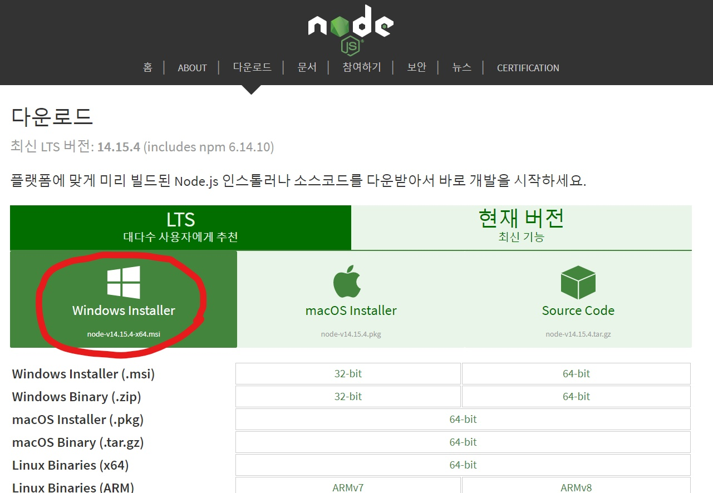
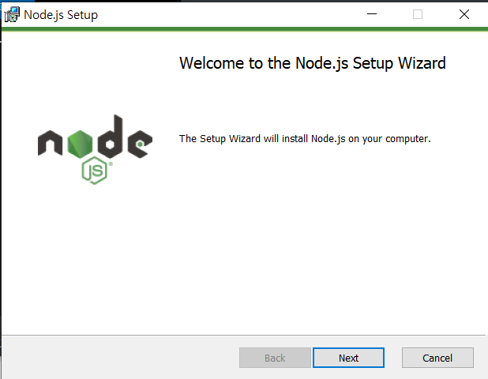

# Vue 설치

2021.01.18

> `Node` 패키지를 이용하여 Vue를 설치하는 방법을 정리한다.

---

[TOC]

---


## 1. Node.js 설치

- [Node.js 홈페이지](https://nodejs.org/ko/download/)에서 `Node` 설치 파일을 다운로드 한다.

- 2021년 1월 18일 기준 최신 LTS 버전은 `14.15.4`이다.

  

- `Setup` 파일을 실행시킨 후, 기본 설정 그대로 진행하여 설치를 완료한다.

  

- `cmd`나 `bash` 창에서 아래의 명령어를 입력하여 `node.js` 설치가 잘 되었는지 확인한다.

  ```bash
  $ node -v
  ```

  - 결과 예시

    ```bash
    v14.15.4
    ```


## 2. Vue 설치

- `bash`창에서 **VUE CLI**를 설치하기 위해 다음의 명령어를 입력한다.

  ```bash
  $ npm install -g @vue/cli
  ```

- 이후 설치가 잘 되었는지 확인해본다.

  ```bash
  $ vue --version
  ```

  - 결과 예시

    ```bash
    @vue/cli 4.5.10
    ```


## 3. Extensions 설치

- Chrome 웹 스토어 tool 설치

  ```markdown
  - Vue.js devtools
  ```

  > 해당 페이지가 Vue로 작성되었다면 Vue로 어떻게 구성되었는지 보여준다.

  

  - :heavy_check_mark: 로컬에서 작성한 `HTML`을 로드하였을 때 확장 프로그램이 실행되지 않는다면 `확장 프로그램 > 세부정보 > 파일 URL에 대한 액세스 허용`을 활성화해준다!

- VSCode extension

  ```markdown
  - Vetur
  ```

  > `Vue.js`의 자동 완성 등을 담당한다.

  ```markdown
  - Live Server
  ```

  > `Eclipse`에서 사용하는 extension으로 VS Code에서 사용하는 서버이다. 로컬 서버 변경 자동 반영

  ```markdown
  - Vue 3 Snippets
  ```

  > Vetur에서 지원하지 않는 자동완성까지 적용

  ```markdown
  - Prettier
  ```

  > `file >> preference >> setting or Ctrl + ,(comma)`


## <참고> CDN으로 설치

> [Vue.js 공식문서](https://kr.vuejs.org/v2/guide/index.html)

- Chrome 개발자도구(`F12`)의 `Vue` 탭에서 해당 페이지의 구성을 확인할 수 있다.

- CDN을 공식문서에서 가져온다.

```html
<!-- 개발버전, 도움되는 콘솔 경고를 포함. -->
<script src="https://cdn.jsdelivr.net/npm/vue/dist/vue.js"></script>
```

```html
<!-- 상용버전, 속도와 용량이 최적화됨. -->
<script src="https://cdn.jsdelivr.net/npm/vue"></script>
```


***Copyright* © 2021 Song_Artish**