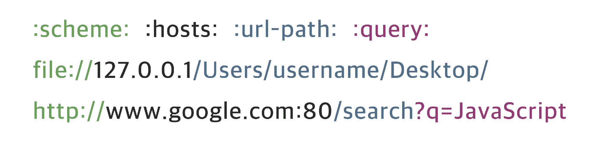

# Network

---

[TOC]

---

## URL

URL은 `Uniform Resource Locator`의 약자로, **서버가 제공되는 환경에 존재하는 파일의 위치**를 나타낸다. URL은 `scheme`, `hosts`, `url-path`로 구성된다.

**URI**는 Uniform Resource Identifier의 약자로, URL을 포함하는 상위개념이다. 일반적으로 URL의 기본 요소인 `scheme`, `hosts`, `url-path`에 더해 `query`,  `bookmark`를 포함한다.

|   명칭   | 설명                                                         |                                     |
| :------: | :----------------------------------------------------------- | ----------------------------------- |
|  scheme  | 통신 프로토콜                                                | `file://`, `http://`, `https://`    |
|  hosts   | 웹 페이지, 이미지, 동영상 등의 파일이 위치한 웹 서버, 도메인 또는 IP | `127.0.0.1`, `www.google.com`       |
|   port   | 웹 서버에 접속하기 위한 통로                                 | `:80`, `:443`, `:3000`              |
| url-path | 웹 서버의 루트 디렉토리로부터 웹 페이지, 이미지, 동영상 등의 파일의 위치까지의 경로 | `/search`, `Users/username/Desktop` |
|  query   | 웹 서버에 전달하는 추가 질문                                 | `q=JavaScript`                      |

## IP

IP는 Internet Protocol의 줄임말로, 네트워크에 연결된 특정 PC의 **주소를 나타내는 체계**를 **IP 주소**라고 한다. 인터넷에 연결된 모든 PC는 IP 주소 체계에 따라 dot(`.`)으로 구분된 네 덩이의 숫자로 이루어지는데, 이러한 IP 주소 체계를 **IPv4**라고 한다. IPv4는 Internet Protocol version 4의 줄임말로, IP 주소 체계의 4번째 버전을 의미한다.

- `localhost`, `127.0.0.1`: 현재 사용 중인 로컬 PC를 지칭한다.
- `0.0.0.0`, `255.255.255.255`: broadcast address, 로컬 네트워크에 접속된 모든 장치와 소통하는 주소이다. 서버에서 접근 가능 IP주소를 broadcast address로 지정하면, 모든 기기에서 서버에 접근할 수 있게 된다.

`(출처: comparitech)`

## Port

Port(포트)는 **IP 주소에 진입할 수 있는 정해진 통로**이다. `localhost:3000`에서 `:3000`은 IP 주소가 가리키는 PC에 접속할 수 있는 통로(채널)를 의미한다. 포트 번호는 0 ~ 65,535까지 사용할 수 있으며, 그 중에서 0 ~ 1024번까지는 주요 통신을 위한 규약에 따라 이미 정해져 있다. 

- 22: SSH
- 80: HTTP
- 443: HTTPS

하지만, 이미 정해진 포트 번호라도 필요에 따라 자유롭게 사용할 수 있다. 잘 알려진 포트의 경우 URI 등에 명시하지 않지만, 그 외의 잘 알려지지 않은 포트(`:3000`와 같은 임시 포트)는 반드시 명시되어야 한다. 이미 사용 중인 포트는 중복해서 사용할 수 없다.

## Domain

웹 브라우저에서 특정 사이트에 진입할 때, **IP 주소를 대신하여 사용하는 주소**를 도메인 이름(domain name)이라고 한다. 예를 들어, IP 주소가 `3.34.153.168`이고, 도메인 이름이 `yogurt.com`인 경우, 주소창에 IP 주소를 입력하면 `yogurt.com`으로 이동할 수 있다.

**DNS**는 Domain Name System의 줄임말로, 호스트의 도메인 이름을 IP 주소로 변환하거나 반대의 경우를 수행할 수 있도록 개발된 DB 시스템이다. 만약 브라우저 검색창에 `naver.com`을 입력하면, 이 요청은 DNS에서 IP 주소(`125.209.222.142`)를 찾는다. 그리고 이 IP 주소에 해당하는 웹 서버로 요청을 전달하여 클라이언트와 서버가 통신할 수 있도록 한다.

***Copyright* © 2022 Song_Artish**