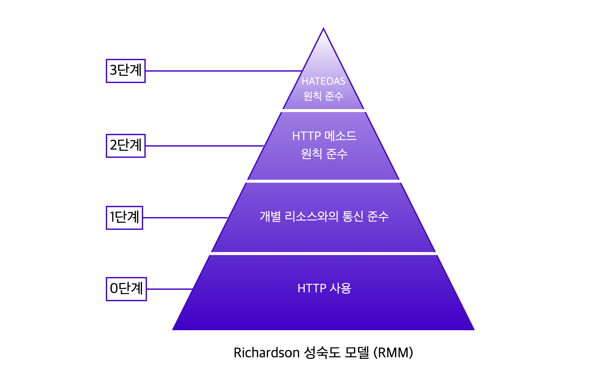

# API

---

[TOC]

---

## Overview

API(Application Programming Interface)는 프로그래밍에서, 프로그램을 작성하기 위한 일련의 Sub 프로그램, 프로토콜 등을 정의하여 상호 작용을 하기 위한 인터페이스 specification이다.

## REST API

REST API에서 `REST`는 "Representational State Transfer"의 약자로, 로이 필딩의 박사학위 논문에서 웹(http)의 장점을 최대한 활용할 수 있는 아키텍처로써 처음 소개되었다. REST API는 **웹에서 사용되는 데이터나 리소스를 HTTP URI로 표현하고, HTTP 프로토콜을 통해 요청과 응답을 정의하는 방식**을 말한다.

### Richardson 성숙도 모델

Richardson의 REST 성숙도 모델(RMM)은 REST API를 잘 적용하기 위한 모델로, 4단계로 구성되어 있다.

`(출처: https://velog.io/@estell)`

API를 작성할 때, RMM의 2단계까지 적용하면 대체적으로 잘 작성된 API라고 여긴다.

| Step |                           | Desc.                                                        |
| ---- | ------------------------- | ------------------------------------------------------------ |
| 0    | HTTP 사용                 | 단순히 HTTP 프로토콜 사용                                    |
| 1    | 개별 리소스와의 통신 준수 | 모든 자원은 개별 리소스에 맞는 endpoint를 사용해야 하며, 요청하고 받은 자원에 대한 정보를 응답으로 전달해야 함 |
| 2    | HTTP 메서드 원칙 준수     | CRUD에 맞게 적절한 HTTP 메소드를 사용                        |
| 3    | HATEOAS 원칙 준수         | HATEOAS(Hypertext As The Engine Of Application State), 하이퍼미디어 컨트롤을 적용한다. 응답에 리소스의 URI를 포함한 링크 요소를 삽입하여 작성한다. |

## Open API

공개되어 있는 API이다. 대부분의 API는 이용하기 위해서는 **API Key**가 필요하며, 데이터를 요청할 때 API key를 같이 전달해야만 원하는 응답을 받을 수 있다.

- [공공데이터포털](https://www.data.go.kr/)
- [Open Weather Map](https://openweathermap.org/api)

## API 테스트 도구

HTTP API 테스트 도구는 클라이언트 입장에서 서버 API를 테스트하거나, API를 만드는 과정에서 유용하게 사용할 수 있다.

- CLI
  - `curl` (대부분의 linux 환경에 내장되어 있음)
  - [wuzz](https://github.com/asciimoo/wuzz)
- GUI
  - [Postman](https://www.postman.com/)
  - [Insomnia](https://insomnia.rest/)

***Copyright* © 2022 Song_Artish**