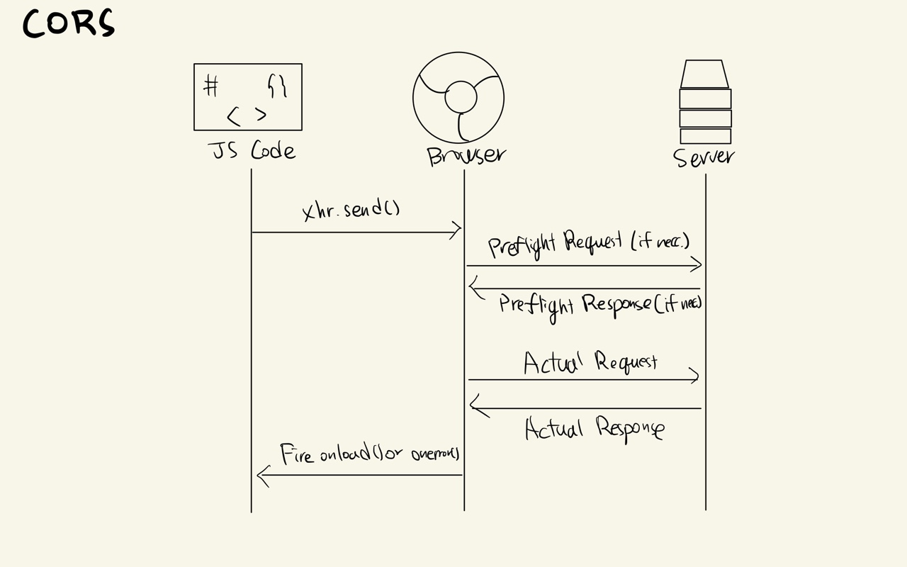

# Web Security

---

[TOC]

---

## Overview

자세한 내용은 [Web security](https://developer.mozilla.org/en-US/docs/Web/Security)를 참고한다.

## MDN에서 제시하는 종류

### Content Security

### Connection Security

### Data Security

### Information Leakage

### Integrity

### Clickjacking Protection

### User Information Security

## Browser Security

> 클라이언트 보안 > 브라우저 보안

Browser security is the application of Internet security to web browsers in order to protect networked data and computer systems from breaches of privacy or malware. 

### CORS

CORS(Cross-Origin Resource Sharing) is a system, consisting of transmitting [HTTP headers](https://developer.mozilla.org/en-US/docs/Glossary/HTTP_header), that determines whether browsers block frontend JavaScript code from accessing responses for cross-origin requests.

The [same-origin security policy](https://developer.mozilla.org/en-US/docs/Web/Security/Same-origin_policy) forbids cross-origin access to resources. But CORS gives web servers the ability to say they want to opt into allowing cross-origin access to their resources.

### XSS 

### CSRF

***Copyright* © 2022 Song_Artish**