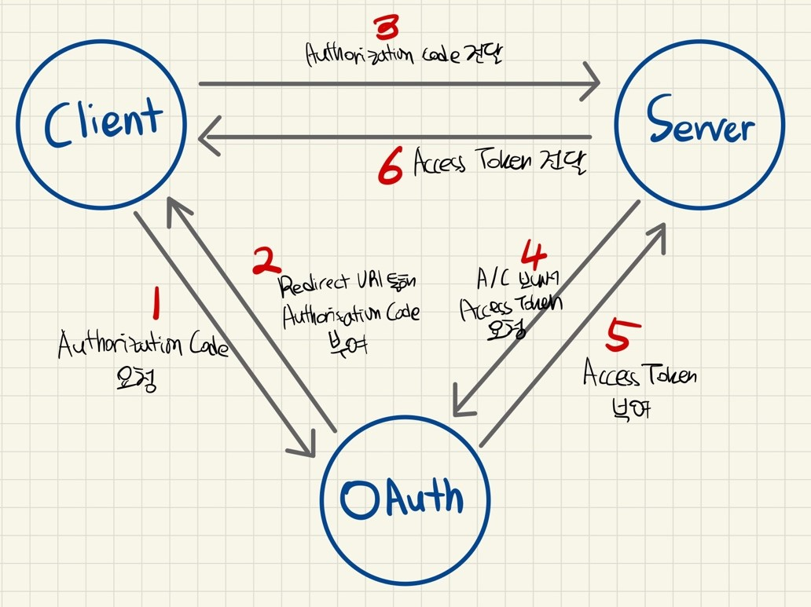

# Web Authentication

---

[TOC]

---


## Cookie

쿠키는 서버에서 클라이언트에 데이터를 저장하는 방법의 하나로, **서버가 일방적으로 클라이언트에 전달하는 작은 데이터**를 의미한다. 서버가 **웹 브라우저에 정보를 저장**하고 불러올 수 있는 수단이며, 사용자 선호, 테마 등 장시간 보존해야하는 정보 저장에 적합하다. 해당 도메인에 대해 쿠키가 존재하면, 웹 브라우저는 도메인에게 http 요청 시 쿠키를 함께 전달한다.

쿠키를 사용하면 stateless한 인터넷 연결을 stateful하게 유지할 수 있다. 하지만, 기본적으로 쿠키는 오랜 시간 동안 유지될 수 있고, 자바스크립트를 이용해서 쿠키에 접근할 수 있기 떄문에 쿠키에 민감한 정보는 담는 것은 위험하다.

### Set-Cookie

`Set-Cookie` HTTP Response Header는 서버에서 사용자 브라우저에 쿠키를 전송하기 위해 사용된다. 옵션들을 지정한 다음, 서버에서 클라이언트로 쿠키를 처음 전송하게 된다면 헤더에 `Set-Cookie`라는 프로퍼티에 쿠키를 담아 쿠키를 전송하게 된다. 이후 클라이언트 혹은 서버에서 쿠키를 전송해야 한다면 클라이언트는 헤더에 `Cookie`라는 프로퍼티에 쿠키를 담아서 서버에 쿠키를 전송한다.

- 공식문서: https://developer.mozilla.org/ko/docs/Web/HTTP/Headers/Set-Cookie

```
// 문법
Set-Cookie: <cookie-name>=<cookie-value>
Set-Cookie: <cookie-name>=<cookie-value>; Domain=<domain-value>; Secure; HttpOnly
```

### Cookie Options

**Domain**

서버와 요청의 도메인이 일치하는 경우 쿠키를 전송한다. 도메인은 `www.google.com`과 같은 서버에 접속할 수 있는 이름이다.

```
Set-Cookie: <cookie-name>=<cookie-value>; Domain=<domain-value>
```

**Path**

서버와 요청의 세부 경로가 일치하는 경우 쿠키를 전송한다. 세부 경로는 서버가 라우팅할 때 사용하는 경로로, url이 `http://www.localhost.com:3000/users/login`인 경우라면 `/users/login`에 해당된다. Path 옵션은 설정된 path를 전부 막족하는 경우, 요청하는 Path가 추가로 더 존재하더라도 쿠키를 서버에 전송할 수 있다.

```
Set-Cookie: <cookie-name>=<cookie-value>; Path=<path-value>
```

**MaxAge** or **Expires**

쿠키의 유효기간을 설정하는 옵션이다.

- MaxAge는 앞으로 몇 초 동안 쿠키가 유효한지 설정하는 옵션이다.
- Expires는 언제까지 유효한지 `Date`를 지정한다. (클라이언트 시간 기준)

```
Set-Cookie: <cookie-name>=<cookie-value>; Max-Age=<non-zero-digit>
Set-Cookie: <cookie-name>=<cookie-value>; Expires=<date>
```

지정된 시간, 날짜가 초과하게 되면 자동으로 쿠키가 파괴된다. 두 오셥이 모두 지정되지 않은 경우에는 브라우저의 탭을 닫아야만 쿠키가 제거된다.

**Secure**

쿠키를 전송해야 할 때 사용하는 프로토콜에 따른 쿠키 전송 여부를 결정한다. 만약 옵션이 `true`로 설정된 경우, HTTPS 프로토콜을 이용하여 통신하는 경우에만 쿠키를 전송할 수 있다.

```
Set-Cookie: <cookie-name>=<cookie-value>; Secure
```

**HttpOnly**

스크립트에서 브라우저의 쿠키에 접근 여부를 결정한다. 명시되지 않은 경우 기본으로 `false`로 지정되어 있으며, 이 경우 XSS 공격에 취약하다. 옵션이 `true`로 설정된 경우, 자바스크리브에서는 쿠키에 접근이 불가하다.

```
Set-Cookie: <cookie-name>=<cookie-value>; HttpOnly
```

**SameSite**

Cross-Origin 요청을 받은 경우 요청에서 사용한 메소드와 해당 옵션의 조합으로 서버의 쿠키 전송 여부를 결정할 수 있다. 사용 가능한 옵션은 다음과 같다.

- **Lax**: Cross-Origin 요청이면 'GET' 메소드에 대해서만 쿠키를 전송할 수 있다.
- **Strict**: Cross-Origi이 아닌 `same-site`인 경우에만 쿠키를 전송할 수 있다.
- **None**: 항상 쿠키를 보내줄 수 있다. 다만 쿠키 옵션 중 `Secure` 옵션이 필요하다.

```
Set-Cookie: <cookie-name>=<cookie-value>; SameSite=Strict
Set-Cookie: <cookie-name>=<cookie-value>; SameSite=Lax
```


## Session

사용자가 인증에 성공한 상태를 **세션(Session)**이라고 부른다. Session을 사용하여 **중요 데이터는 서버에서 관리**할 수 있으며, 데이터를 서버에 저장하면 서버가 클라이언트에 유일하고 암호화된 ID를 부여한다.

이 때, 웹사이트에서 로그인을 유지하기 위한 수단으로 쿠키를 사용한다. 쿠키에는 서버에서 발급한 세션 아이디를 저장한다. 

|             | 설명                                                         | 접속 상태 저장경로 | 장점                                              | 단점                                               |
| ----------- | ------------------------------------------------------------ | ------------------ | ------------------------------------------------- | -------------------------------------------------- |
| **Cookie**  | 쿠키는 그저 http의 stateless한 것을 보완해주는 도구          | 클라이언트         | 서버에 부담을 덜어줌                              | 쿠키 그 자체는 인증이 아님                         |
| **Session** | 접속 상태를 서버가 가짐(stateful)<br />접속 상태와 권한 부여를 위해 세션아이디를 쿠키로 전송 | 서버               | 신뢰할 수 있는 유저인지 서버에서 추가로 확인 가능 | 하나의 서버에서만 접속 상태를 가지므로 분산에 불리 |

**로그아웃**을 하는 경우에는 다음의 2가지 작업이 진행되어야 한다.

- 서버의 세션 정보를 삭제한다.
- 클라이언트의 쿠키를 갱신한다.

서버가 클라이언트의 쿠키를 임의로 삭제할 수 없다. 대신, `set-cookie`로 세션 아이디의 키 값을 무효한 값으로 갱신해야 한다.

### express-session

세션을 위한 미들웨어로, Express에서 세션을 다룰 수 있는 공간을 보다 쉽게 만들어준다. 필요한 경우 세션 아이디를 쿠키에 저장하고, 해당 세션 아이디에 종속되는 고유한 세션 객체를 서버 메모리에 저장하는데, 이때 세션 객체는 서로 독립적인 객체이므로 각각 다른 데이터를 저장할 수 있다. `req.session`이 바로 ㅅ션 객체이며, 세션 객체에 세션 데이터를 저장하거나 불러오기 위해 사용한다.

- 문서: https://github.com/expressjs/session#reqsession

```bash
npm install express-session
```

다음과 같이 사용할 수 있다.

```javascript
var session = require('express-session')

var app = express()
app.set('trust proxy', 1) // trust first proxy
app.use(session({
  secret: 'keyboard cat',
  resave: false,
  saveUninitialized: true,
  cookie: { secure: true }
}))
```


## Token

세션 기반 인증은 서버(DB)에 유저 정보를 담는 방식으로, 인증을 할 때마다 서버에 요청을 보내어 확인해야만 했다. 이러한 부담을 줄이기 위해 **토근기반 인증**이 고안되었다. 여기서 토큰은 유저 정보를 암호화한 상태로 담을 수 있다.

> **JWT (JSON Web Token)**

토큰기반 인증에는 대표적으로 `JWT`이 있다. JWT는 JSON 포맷으로 사용자에 대한 속성을 저장하는 웹 토큰으로, **권한 부여**에 굉장히 유용하다.

### JWT 종류

1. **Access Token**: 보호된 정보들(이메일, 연락처 사진 등)에 접근할 수 있는 권한부여에 사용
2. **Refresh Token**: 새로운 access token을 발급하는데 사용

Access Token은 탈취되는 문제에 대비하여, 비교적 `짧은 유효기간`을 주어 탈취되더라도 오랫동안 사용할 수 있도록 하는 것이 좋다. Access token의 유효기간이 만료되면 refresh token을 사용하여 새로운 access token을 발급받는다. 각 방법들은 장단점을 참고하여 필요에 맞게 사용하는 것이 좋다. :)

### JWT 구조

```JSON
aaaaaa.bbbbbb.cccccc
// Header.Payload.Signature로 구성
```

- **Header**: 토큰 종류, 암호화 알고리즘에 대한 내용을 담고 있다.
- **Payload**: 유저 정보, 권한 부여 여부 및 기타 필요한 정보를 담고 있다.
- **Signature**: Header, Payload를 base64인코딩한 값과 salt 값의 조합으로 암호화된 값이다.

```json
{"alg":"HS256","typ":"JWT"}	// Header
{"sub":"someInformation","name":"phillip","iat":151623391}	// Payload
HMACSHA256(base64UrlEncode(header)+"."+base64UrlEncode(payload), secret)	// Signature
```

### 인증 절차

토큰기반 인증의 인증 절차는 다음과 같다.

- Client가 서버에 아이디/비밀번호를 담아 로그인 요청을 보낸다.
- Server에서는 아이디/비밀번호를 확인 후 암호화된 토큰을 생성해서 보내준다.
- Client는 토큰을 받아 저장한다. (저장 위치는 local storage, cookie, react의 state 등 다양하다.)
- Client는 이후 요청 시 HTTP 헤더(authorization 헤더)에 토큰을 담아서 보낸다. ([bearer authentication](https://learning.postman.com/docs/sending-requests/authorization/#bearer-token)을 이용)
- Server는 토큰을 확인 후 이상이 없으면 응답을 보내준다.

### 장점

1. Statelessness & Scalability (무상태성 & 확장성)
   - 서버는 클라이언트에 대한 정보를 저장할 필요가 없음
   - 토큰을 헤더에 추가함으로 인증절차 완료
2. 안정성
   - 암호화한 토큰 사용
   - 암호화 키를 노출 할 필요가 없음
3. 어디서나 생성 가능
   - 토큰을 생성하는 서버가 꼭 토큰을 만들지 않아도 됨
4. 권한 부여 용이
   - 토큰의 payload 안에 어떤 정보에 접근 가능한지 정의할 수 있음


## OAuth

> OAuth 2.0은 인증을 위한 표준 프로토콜의 한 종류이다.

웹이나 앱에서 흔히 볼 수 있는 소셜 로그인 인증 방식은 `OAuth 2`라는 기술을 바탕으로 구현된다. **OAuth는 인증을 중개해주는 메커니즘**인데, 보안된 리소스에 액세스하기 위해 클라이언트에게 권한을 제공하는 프로세스를 단순화하는 프로토콜이다. 즉, 이미 사용자 정보를 가지고 있는 웹 서비스(GitHub, Google, Facebook 등)에서 사용자의 인증을 대신해주고, 접근 권한에 대한 토큰을 발급한 후 이를 이용해 내 서버에서 인증이 가능하게 된다.

### 용어

- **Resource Owner**: 액세스 중인 리소스의 유저 (ex. 현재 user)
- **Client**: Resource owner를 대신하여 보호된 리소스에 액세스하는 응용프로그램 (ex. App)
- **Resource Server**: Client의 요청을 수락하고 응답할 수 있는 서버 (ex. Facebook)
- **Authorization Server**: Resource server가 액세스 토큰을 발급받는 서버 (ex. Facebook)
- **Authorization Grant**: Client가 액세스 토큰을 얻을 때 사용하는 자격 증명
- **Authorization Code**: Access Token을 발급받기 전에 필요한 code
- **Access Token**: 보호된 리소스에 액세스하는 데 사용되는 credentials
- **Scope**: 주어진 액세스 토큰을 사용하여 액세스 할 수 있는 리소스의 범위

### Grant Type

Client가 액세스 토큰을 얻는 방법을 의미한다.

- **Authorization Code Grant Type**: 액세스 토큰을 받아오기 위해서 먼저 Authorization Code를 받아 액세스 토큰과 교환하는 방법으로, 가장 일반적으로 사용되는 grant type이다.

  ```
  Authorization Code 절차를 거치는 이유는 보안성 강화에 목적이 있다.
  Client에서 client-secret을 공유하고 액세스 토큰을 가지고 오는 것은 탈취될 위험이 있기 때문에 Client에서는 authorization code만 받아오고 Server에서 Access token 요청을 진행한다.
  ```

- Implicit Grant Type

- Client Credentials Grant Type

- Resource Owner Credentials Grant Type

- **Refresh Token Grant Type**




***Copyright* © 2022 Song_Artish**