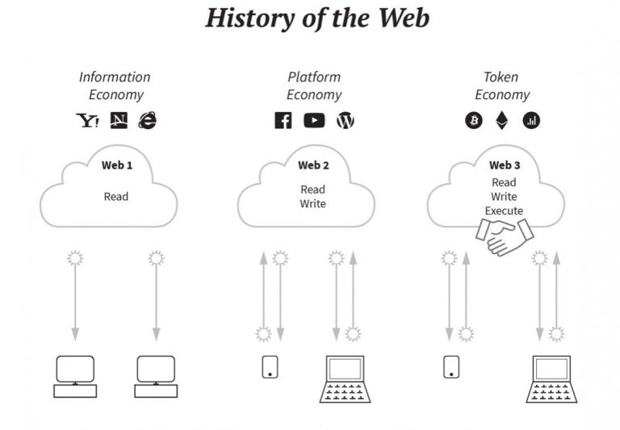

# Web3

---

[TOC]

---

## Overview

### Web1

Web1에서는 클라이언트(사용자)가 서버로부터 콘텐츠를 제공받는다. 클라이언트가 정보를 읽기(read)만 할 수 있었기 때문에 Information Economy라고도 부른다.

### Web2

Web2에서는 인터넷이 동적인 성격으로 변하여 사용자는 정보를 소비할 뿐만 아니라 생성할 수 있다. AJAX의 등장으로 클라이언트는 서버로부터 단순히 정보를 받기만 하는 것이 아니라, 서버와 상호작용하면서 서버에 기록(write)도 할 수 있게 되었다. 자신들이 만든 웹 어플리케이션에서 많은 사용자들을 참여시키는 플랫폼 형태의 어플리케이션이 등장했다.

그러나 Web2를 대표하는 Platform Economy에는 중요한 문제가 있다. 구글, 페이스북, 아마존과 같은 소수 대기업들이 만든 플랫폼을 사용하기 위해 사용자는 자신의 개인정보를 플랫폼에 제공해야 한다는 것이다. 사용자의 의도와는 다르게 플랫폼 기업에 의해 개인 정보가 사용되고, 또한 개인 정보에 대한 보안도 각 기업에게 의존해야 하는 문제가 발생한다.

### Web3

Web3는 중앙집중적인 플랫폼 이코노미를 벗어나 모든 참여자가 플랫폼이 될 수 있는 분산형 인터넷을 의미하며, 블록체인 기술을 기반으로 한다. Web2의 문제를 해결하기 위해 등장하였는데, 모든 참여자가 플랫폼이 되기 때문에 모든 데이터가 공유되며, 동시에 암호화 기술을 사용해 개인 정보를 제공하지 않고도 사용자는 신원을 식별할 수 있다.

## Web3의 장점

- 네트워크에 참여하는 누구나 서비스를 사용하기 위한 권한을 가지고 있다. (누구도 허가 받을 필요 X)
- 누구도 특정 사용자가 서비스에 접근하지 못하도록 거부할 수 없다.
- 결제는 자체 토큰(Ether 등)을 사용한다.
- Web3 기반의 dApp은 탈중앙화되어 있기 때문에 누군가가 게시글을 검열하는 것이 불가능하다.
- Web3 서버는 수천 대의 노드로 구성된 분산형 네트워크이기 때문에 특정 노드가 죽어도 서비스는 계속 유지된다.

***Copyright* © 2022 Song_Artish**