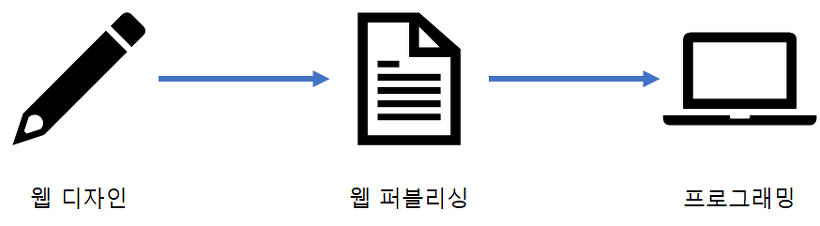

# 퍼블리싱

> HTML과 CSS 언어를 사용하여 웹사이트를 제작하는 행위

2022.03.29

---

[TOC]

---

## Overview

`(출처: https://hyoje420.tistory.com/27`

> 웹 디자이너에 의해서 디자인된 웹 페이지를 HTML, CSS, Java Script를 통해 브라우저에서 나타날 수 있도록 웹 페이지화 하는 것

- 디자이너의 의도를 잘 이해하여 웹 페이지를 시각적으로 보기 좋게 표현
- 프로그래머가 퍼블리싱된 페이지를 가지고 프로그래밍을 하기에 편하게 제작하는 것
- **디자인과 프로그래밍의 연결고리**

## 퍼블리싱에 필요한 기술

### 이미지 분석

- 웹 디자이너가 디자인한 이미지 형태의 웹 페이지를 바탕으로 모든 요소의 크기와 위치를 정확하게 파악
- 그리고 그 정보를 바탕으로 HTML과 CSS를 작성

### HTML

- Hyper Text Markup Language
- 웹 페이지의 구조를 정의

### CSS

- Cascading Style Sheet
- 웹 페이지의 디자인적인 요소들을 명시하는 역할

### Java Script

- 웹에 생동감을 불어넣어주는 역할

## 개발 도구

### Photoshop

- 웹 페이지 구조에서 각 요소들의 크기와 위치를 파악할 수 있음 (**이미지 분석**)
- cf) Glimp: Ubuntu에서도 사용할 수 있는 이미지 편집 tool

### VS Code

- 코드 highlight 기능이 있는 가벼운 **텍스트 편집기**

### Chrome

- Chrome에서 개발자를 위한 **요소검사 기능** 사용 (`F12`)

***Copyright* © 2022 Song_Artish**