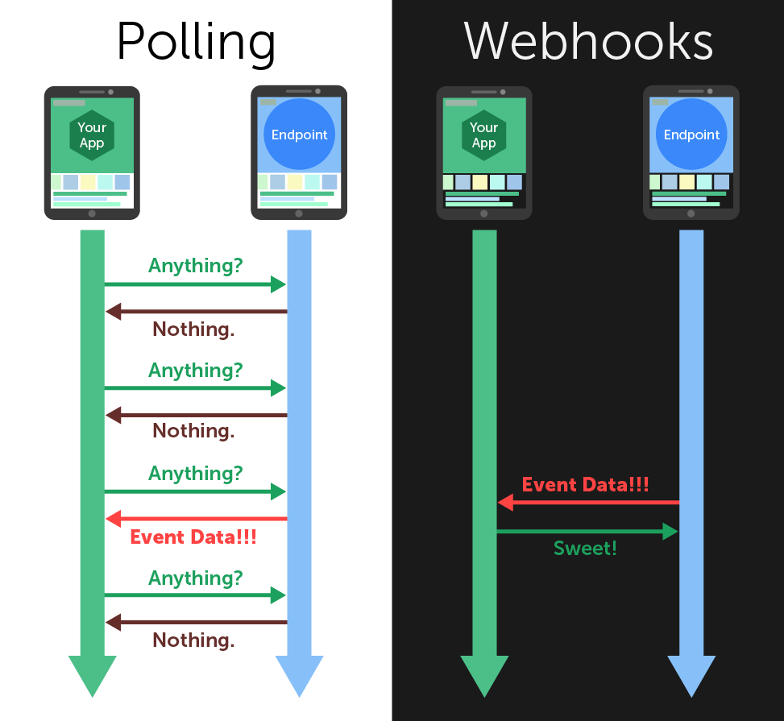

# Webhook

> A `webhook` in **web development** is a method of augmenting or altering the behavior of a **web page or web application** with custom **callbacks**.

2022.03.29

---

[TOC]

---

## Overview

일반적인 API(Polling)는 클라이언트가 서버를 호출하는 방식이다. 하지만 Webhook의 경우 **서버에서 특정 이벤트가 발생했을 때 클라이언트를 호출하는 방식**이며 `역방향 API`라고도 부른다.

## :warning: 유의 사항

- 어떠한 이유에 의해 웹앱이 중단되는 경우, webhook으로부터 오는 데이터는 유실될 가능성이 있다.
- 또, Webhook으로부터 오는 요청에 대해 처리를 완료하였으나 response를 제대로 보내지 못했을 경우에는 webhook에서 response가 실패인 것을 확인하고 동일한 정보를 다시 보낼 가능성이 있다.

-> 문제 발생 가능성을 염두해두고 **예외처리**해주어야 한다!

***Copyright* © 2022 Song_Artish**