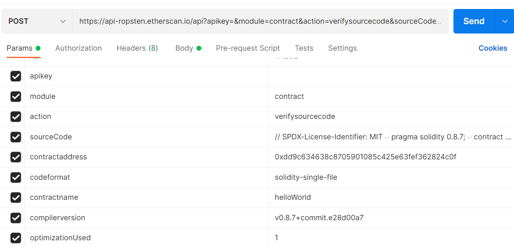

# Third Party API Service

---

[TOC]

---


## Infura

테스트넷 또는 메인넷에 있는 노드 RPC Call을, Infura라는 플랫폼을 통해 스마트 컨트랙트를 Web3.js로 제어해본다.

> - Infura: https://infura.io/

먼저 Infura 프로젝트에서 ENDPOINTS를 ROPSTEN NETWORK로 변경 후, EndPoints를 복사한다.
테스트를 위해 Remix를 통해 Ropsten Network에 `Hello World.sol` 파일을 배포한다.

ABI와 배포된 Contract Address를 복사해 다음과 같은 코드를 만든다.

```javascript
const express = require('express')
const app = express()
const port = 8080
const Contract = require('web3-eth-contract')

async function helloWorld() {
    try {
        const abi = []  //   abi
        const address = ''  // contract address
        Contract.setProvider('https://ropsten.infura.io/v3/...')    //  API Key
        const contract = new Contract(abi, address)
        const result = await contract.methods.renderHelloWorld().call()
        console.log(result)
        return result
    }
    catch(error) {
        console.log(error)
        return error
    }
}

app.get('/helloworld', (req, res) => {
    helloWorld().then((result) => {
        res.send(result)
    })
})

app.listen(port, () => {
    console.log('Listening...')
})
```

setProvider에 로컬호스트가 아닌 `ropsten.infura.io/v3/~~~`가 들어간 것을 확인할 수 있다. http://localhost:8080/helloworld 에 접속해 잘 작동하는지 확인한다.

이와 같은 방법으로 infura를 활용하여 Ropsten Network 테스트가 가능한다. 또한 Infura를 결제해 활용한다면 메인넷에서도 사용이 가능하다.


## Etherscan API

이더스캔에서도 이더리움 개발자에게 노드 환경을 제공하는 이더스캔 API를 제공한다.

> 이더스캔 API 공식문서: https://docs.etherscan.io/

1. 먼저 이더스캔 API 무료 플랜을 사용하기 위해 [이더스캔에 가입](https://etherscan.io/register)한다.
2. My Profile > API-Keys로 이동하면 `Current API Plan`을 통해 무료 API 플랜이 적용된 것을 확인할 수 있다.
    무료 API 플랜에서는 초당 5번의 API콜을 허용하고, 하루 10만 개의 요청까지 허용한다.
    > 이더스캔 API를 사용하는 업체로는 코인베이스, 코인게코, 메탐스크, 아임토큰 등이 있다. 즉, 메타마스크 등에서 제공하는 API는 이더스캔 API와 연동이 되어있다.
3. API-Keys 화면에서 `+ Add` 버튼을 눌려 키를 생성한다.
    해당 키를 이용하면 GET/POST 요청 방식으로 이더스캔 API를 사용할 수 있다.
4. 이더스캔 공식 문서에서 [Endpoint URLs](https://docs.etherscan.io/getting-started/endpoint-urls) 페이지를 확인한다.
5. Ropsten Network의 URL을 복사한다.
    다음과 같은 방식으로 Account의 이더 잔액을 확인할 수 있다.
    ```
    https://api-ropsten.etherscan.io/api
        ?module=account
        &action=balance
        &address=YourAddress
        &tag=latest
        &apikey=YourApiKeyToken
    ```
    그 외에도 https://docs.etherscan.io/v/ropsten-etherscan/ 페이지에서 테스트넷에서 사용가능한 다양한 API들을 확인할 수 있다.
6. API를 활용한 소스코드 업데이트용 데모 페이지도 제공한다.
    - https://etherscan.io/sourcecode-demo.html

아래 링크를 참고하여 배포한 스마트 컨트랙트 소스코드를 Verify & Publish 할 수도 있다.

- [Verifying Contracts Programmatically](https://docs.etherscan.io/tutorials/verifying-contracts-programmatically)




## Goingecko

[Coingecko](https://www.coingecko.com/ko)는 암호화폐 실시간 가격, 거래량, 과거 데이터, 컨트랙트 정보와 같은 다양한 데이터를 API 형태로 제공한다.

> - CoinGecko API 공식 문서: https://www.coingecko.com/ko/api/documentation

예를 들어 `https://api.coingecko.com/api/v3/coins/ethereum/`는 이더리움 정보를 받아오는 API 엔드포인트이다. 여기서 `current_price` 항목을 찾으면 usd, krw 등 가격 정보를 받아올 수 있다. 이를 통해 실제 사용되는 가스비를 price로 계산하여 얼마가 드는지 확인하는 API를 개발하는 등, dApp 개발에 활용할 수 있다.


## Klaytnscope

[Klaytnscope](https://scope.klaytn.com/)은 클레이튼 네트워크의 블록 탐색기이다. 클레이튼 네트워크의 트랜잭션, 블록, 주소를 검색할 수 있으며, 네트워크의 상태를 모니터링하고 네트워크게 대한 다양한 통계를 제공한다.

**대시보드**

네트워크 정보는 대시보드에 나타난다.

- Block Height: 마지막 블록의 높이
- Network Performance: 클레이튼 네트워크의 퍼포먼스를 4개의 지표로 보여준다.
    - Consensus Nodes: 컨센서스 과정에 참여하고 있는 노드의 개수
    - Avg Block Time (1 Hour): 지난 한 시간 동안 평균 블록 생성 시간
    - Avg Block Time (24 Hour): 지난 24시간 동안 평균 블록 생성 시간
    - Avg Tx Per Block (1 Hour): 지난 24시간 동안 하나의 블록에 들어가 있는 트랜잭션의 평균 개수
- Transaction History (14 days): 지난 14일 간 일어난 일일 트랜잭션 수 그래프

**Blocks & Transactions**

Recent Blocks와 Recent Transactions에는 최근에 생성된 블록과 트랜잭션이 표시된다.

**Network 상태 & Network 선택**

대시보드 오른쪽 위에는 네트워크 상태 indicator와 네트워크 선택 dropdown이 있다.

- 네트워크 상태 indicator
    - Network is healthy
    - Data Latency: Klaytnscope가 시스템을 정비하고 있어 데이터가 지연되고 있는 상태이다.
    - Data accuracy: Klaytnscope가 데이터를 동기화하고 있으며 기다려야 한다.
- 네트워크 선택 dropdown
    - 메인넷
    - Baobab Network (테스트넷)

**Blocks**

최근 생성된 블록의 리스트가 있다.

- Block #: 블록의 고유 번호로, 누르면 블록 세부 정보 확인 가능
- Time: 블록 생성 경과 시간
- Total TXS: 블록에 들어있는 트랜잭션 개수
- Block Proposer: 제안자(proposer)의 주소. 클레이튼은 컨센서스 블록체인이기 때문에 제안 노드는 컨센서스 노드에 의해 무작위적이나 결정적으로(randomly but deterministically) 선택된다.
- Reward(Klay): 컨소시움 노드와 제안자, KIR에게 지급되는 보상 비용. 블록이 생성될 때 민팅된 9.6 KLAY와 트랜잭션 실행 시 사용된 트랜잭션 수수료의 합이 보상 비용이 됨
- Size(Byte): 블록의 크기

블록 번호를 클릭하면 해당 블록의 세부 정보를 확인할 수 있다.

**Transactions**

최근 실행된 트랜잭션의 리스트가 있다.

- TX Hash: 트랜잭션 해시값
- Block #: 트랜잭션이 속한 블록의 번호
- Time: 트랜잭션 실행 경과 시간
- From -> To:트랜잭션 송신자와 수신자의 주소 (컨트랙트 주소는 주소 옆에 파일 아이콘이 있음)
- TX Type: 트랜잭션 타입 (클레이튼 트랜잭션 타입은 [공식문서](https://docs.klaytn.foundation/klaytn/design/transactions)에서 확인)
- Amount: 트랜잭션을 통해 송금된 양
- TX Fee: 트랜잭션 실행에 대한 수수료

트랜잭션 번호(TX Hash)를 누르면 트랜잭션의 세부 정보를 확인할 수 있다. 또한 주소(From -> To)를 눌러 해당 주소의 잔액과 거래내역을 확인할 수도 있다.

**Search**

Klaytscope에서는 계정, 컨트랙트, 트랜잭션, 블록에 관한 정보를 검색할 수 있다.


## KAS

KAS(Klaytn API Service)는 클레이튼 블록체인 네트워크를 API로 제공하는 서비스이다. 네트워크 참여 및 상호작용 과정을 REST API로 실행할 수 있게 해준다. 또한, KAS Console을 통해 API 키와 IP주소를 관리하고, 체인에 기록된 트랜잭션과 토큰을 조회하고, 계정 저장소를 관리하는 등 다양한 기능을 제공한다.

KAS에는 네 종류의 API가 있다.

- **Klaytn Node API**
    Klaytn Endpoint Node를 통해 클레이튼 네트워크에 접근할 수 있다. (별도 노드 구축 X)
- **Token History API**
    모든 클레이튼 계정에서 이루어지는 토큰 전송을 DB에 기록해두고, KLAY 및 FT(KIP-7, ERC-20), NFT(KIP-17, ERC-721) 토큰의 거래내역과 데이터를 조회하는 기능을 제공한다. (Klayscope가 대표적인 예시)
- **Wallet API**
    클레이튼 계정 키를 생성 및 관리하고, 트랜잭션을 생성할 경우 자동으로 서명하여 네트워크에 전송할 수 있도록 해준다.
- **Anchor API**

    > Data Anchoring: 프라이빗 블록체인의 데이터를 주기적으로 퍼블릭 블록체인에 기록하는 것 (무결성 확보를 위해)

    API 호출을 통해 간단하게 데이터 앵커링 트랜잭션을 보낼 수 있다. 앵커링 트랜잭션을 보내는 오퍼레이터 계정을 생성하고, 오퍼레이터를 통해 Anchor API를 호출하여 앵커링 트랜잭션을 실행할 수 있다.


***Copyright* © 2022 Song_Artish**